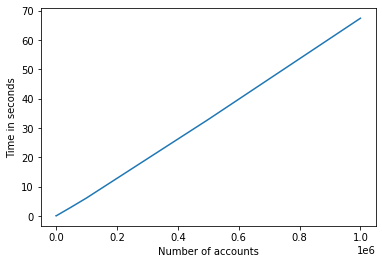

# deepesg_datachallenge

## Solving
Assumptions: The chart of accounts is an ordered tree and is given as a sorted array, meaning that some account B that appears after some account A can never be its parent ( [A, x, y, ... , z, B] -> B is not a parent of a). Also, an account can only have one other account as its parent.

 
 To solve this problem, we will follow the steps below:
 
 1º: Sum all transactions an account has registered in the general ledger. This will result in a matrix with two columns (account_number and value) and the same number of rows (at most)  as the chart of accounts
 
2º: Iterate through all accounts, saving its transactions total value (or zero if the general ledge doesn't have an entry for it), checking for its parent and then saving this information in an array (parent_nodes)

3º: Iterate through all account in backwards, adding the value of an account to its parent

This code should run in linear time in relation to the number of accounts and will output an array account_values and a pandas dataframe with two columns ("account" and "value").

## Testing
To test our algorithm, we will generate some data that we know is right and input it in our code to check if it has the same answer.
Our generated inputs will be called chart_of_accounts and general_ledge, and our generated output will be account_value

### Chart of account
To generate a chart of accounts with N accounts, we will set the first account to be "1" and then iterate through 1 to N. In each of these steps, a random choice will be made: go back a level, keep the level or increase the level. The level in an array that keeps how many nodes are in a certain branch of the tree. 

When we go back a level, we will remove the last element of the level array (if it has more than one element), meaning that a branch has ended.
When we keep the level, we just add 1 to the last element of the level array
When we increase the level, we append a new element to the level array

While in this process, we will also store if a node is a root and all the direct children it has. 

After it, we will have 3 arrays with N elements: chart_of_accounts, is_root and child_list

### General ledger and account_value list
In this code, we will generate the general ledger considering all transactions an account has made have already been summed. 

To generate the general ledger and the account_value list with N accounts, we will need the chart_of_accounts, is_root and child_list. We will iterate through 0 to N. If a node is a root, we will add some random value into its account_value. Then we will store its account_value into temporary_value. Then we will iterate through its children, adding a random fraction of temporary_value to their account_value and subtracting that same fraction from temporary_value. What is left of the temporary_value after this is the general_ledge of this account.

This will return an array with N elements, account_value, and a pandas dataframe, general_ledge, with two columns ("account" and "value").

Testing the code with the following number of accounts:

	n = [1,  2,  3,  4,  5,  6,  7,  8,  9,  10,  11,  12,  13,  14,  15,  16,  17,  18,  19,  20,  21,  22,  23,  24,  25,  26,  27,  28,  29,  30,  31,  32,  33,  34,  35,  36,  37,  38,  39,  40,  41,  42,  43,  44,  45,  46,  47,  48,  49,  50,  51,  52,  53,  54,  55,  56,  57,  58,  59,  60,  61,  62,  63,  64,  65,  66,  67,  68,  69,  70,  71,  72,  73,  74,  75,  76,  77,  78,  79,  80,  81,  82,  83,  84,  85,  86,  87,  88,  89,  90,  91,  92,  93,  94,  95,  96,  97,  98,  99,  100,  101,  102,  103,  104,  105,  106,  107,  108,  109,  110,  111,  112,  113,  114,  115,  116,  117,  118,  119,  120,  121,  122,  123,  124,  125,  126,  127,  128,  129,  130,  131,  132,  133,  134,  135,  136,  137,  138,  139,  140,  141,  142,  143,  144,  145,  146,  147,  148,  149,  150,  151,  152,  153,  154,  155,  156,  157,  158,  159,  160,  161,  162,  163,  164,  165,  166,  167,  168,  169,  170,  171,  172,  173,  174,  175,  176,  177,  178,  179,  180,  181,  182,  183,  184,  185,  186,  187,  188,  189,  190,  191,  192,  193,  194,  195,  196,  197,  198,  199,  200,  201,  202,  203,  204,  205,  206,  207,  208,  209,  210,  211,  212,  213,  214,  215,  216,  217,  218,  219,  220,  221,  222,  223,  224,  225,  226,  227,  228,  229,  230,  231,  232,  233,  234,  235,  236,  237,  238,  239,  240,  241,  242,  243,  244,  245,  246,  247,  248,  249,  250,  251,  252,  253,  254,  255,  256,  257,  258,  259,  260,  261,  262,  263,  264,  265,  266,  267,  268,  269,  270,  271,  272,  273,  274,  275,  276,  277,  278,  279,  280,  281,  282,  283,  284,  285,  286,  287,  288,  289,  290,  291,  292,  293,  294,  295,  296,  297,  298,  299,  300,  301,  302,  303,  304,  305,  306,  307,  308,  309,  310,  311,  312,  313,  314,  315,  316,  317,  318,  319,  320,  321,  322,  323,  324,  325,  326,  327,  328,  329,  330,  331,  332,  333,  334,  335,  336,  337,  338,  339,  340,  341,  342,  343,  344,  345,  346,  347,  348,  349,  350,  351,  352,  353,  354,  355,  356,  357,  358,  359,  360,  361,  362,  363,  364,  365,  366,  367,  368,  369,  370,  371,  372,  373,  374,  375,  376,  377,  378,  379,  380,  381,  382,  383,  384,  385,  386,  387,  388,  389,  390,  391,  392,  393,  394,  395,  396,  397,  398,  399,  400,  401,  402,  403,  404,  405,  406,  407,  408,  409,  410,  411,  412,  413,  414,  415,  416,  417,  418,  419,  420,  421,  422,  423,  424,  425,  426,  427,  428,  429,  430,  431,  432,  433,  434,  435,  436,  437,  438,  439,  440,  441,  442,  443,  444,  445,  446,  447,  448,  449,  450,  451,  452,  453,  454,  455,  456,  457,  458,  459,  460,  461,  462,  463,  464,  465,  466,  467,  468,  469,  470,  471,  472,  473,  474,  475,  476,  477,  478,  479,  480,  481,  482,  483,  484,  485,  486,  487,  488,  489,  490,  491,  492,  493,  494,  495,  496,  497,  498,  499,  500,  501,  502,  503,  504,  505,  506,  507,  508,  509,  510,  511,  512,  513,  514,  515,  516,  517,  518,  519,  520,  521,  522,  523,  524,  525,  526,  527,  528,  529,  530,  531,  532,  533,  534,  535,  536,  537,  538,  539,  540,  541,  542,  543,  544,  545,  546,  547,  548,  549,  550,  551,  552,  553,  554,  555,  556,  557,  558,  559,  560,  561,  562,  563,  564,  565,  566,  567,  568,  569,  570,  571,  572,  573,  574,  575,  576,  577,  578,  579,  580,  581,  582,  583,  584,  585,  586,  587,  588,  589,  590,  591,  592,  593,  594,  595,  596,  597,  598,  599,  600,  601,  602,  603,  604,  605,  606,  607,  608,  609,  610,  611,  612,  613,  614,  615,  616,  617,  618,  619,  620,  621,  622,  623,  624,  625,  626,  627,  628,  629,  630,  631,  632,  633,  634,  635,  636,  637,  638,  639,  640,  641,  642,  643,  644,  645,  646,  647,  648,  649,  650,  651,  652,  653,  654,  655,  656,  657,  658,  659,  660,  661,  662,  663,  664,  665,  666,  667,  668,  669,  670,  671,  672,  673,  674,  675,  676,  677,  678,  679,  680,  681,  682,  683,  684,  685,  686,  687,  688,  689,  690,  691,  692,  693,  694,  695,  696,  697,  698,  699,  700,  701,  702,  703,  704,  705,  706,  707,  708,  709,  710,  711,  712,  713,  714,  715,  716,  717,  718,  719,  720,  721,  722,  723,  724,  725,  726,  727,  728,  729,  730,  731,  732,  733,  734,  735,  736,  737,  738,  739,  740,  741,  742,  743,  744,  745,  746,  747,  748,  749,  750,  751,  752,  753,  754,  755,  756,  757,  758,  759,  760,  761,  762,  763,  764,  765,  766,  767,  768,  769,  770,  771,  772,  773,  774,  775,  776,  777,  778,  779,  780,  781,  782,  783,  784,  785,  786,  787,  788,  789,  790,  791,  792,  793,  794,  795,  796,  797,  798,  799,  800,  801,  802,  803,  804,  805,  806,  807,  808,  809,  810,  811,  812,  813,  814,  815,  816,  817,  818,  819,  820,  821,  822,  823,  824,  825,  826,  827,  828,  829,  830,  831,  832,  833,  834,  835,  836,  837,  838,  839,  840,  841,  842,  843,  844,  845,  846,  847,  848,  849,  850,  851,  852,  853,  854,  855,  856,  857,  858,  859,  860,  861,  862,  863,  864,  865,  866,  867,  868,  869,  870,  871,  872,  873,  874,  875,  876,  877,  878,  879,  880,  881,  882,  883,  884,  885,  886,  887,  888,  889,  890,  891,  892,  893,  894,  895,  896,  897,  898,  899,  900,  901,  902,  903,  904,  905,  906,  907,  908,  909,  910,  911,  912,  913,  914,  915,  916,  917,  918,  919,  920,  921,  922,  923,  924,  925,  926,  927,  928,  929,  930,  931,  932,  933,  934,  935,  936,  937,  938,  939,  940,  941,  942,  943,  944,  945,  946,  947,  948,  949,  950,  951,  952,  953,  954,  955,  956,  957,  958,  959,  960,  961,  962,  963,  964,  965,  966,  967,  968,  969,  970,  971,  972,  973,  974,  975,  976,  977,  978,  979,  980,  981,  982,  983,  984,  985,  986,  987,  988,  989,  990,  991,  992,  993,  994,  995,  996,  997,  998,  999,  1000,  5000,  10000,  50000,  100000,  500000,  1000000]

generates this graph:

Showing that the algorithm runs, indeed, in linear time

 ## Prerequisites
Python libraries numpy and pandas

## Usage

### Main code
To use the algorithm run mainCode.py with the path to the chart of accounts, general ledger and output. This will output an excel file with two columns, one with the account and another with its values.
Example:

		python3 mainCode.py pathToChart pathToGenLedger pathToOutput
Alternatively, you can import this code and call

	account_transactions = getTotalTransaction(general_ledger)
	account_values, chart_and_values = getAccountValues(chart_of_accounts, account_transactions)
The chart_and_values is the dataframe we use to write the excel file, and the account_values is an array equal to the column "value"

### Testing
To use the testing code run testCode.py with the number of tests and maximum number of accounts in each test
Example:

		python3 mainCode.py howManyTests maxNumberOfAccounts
